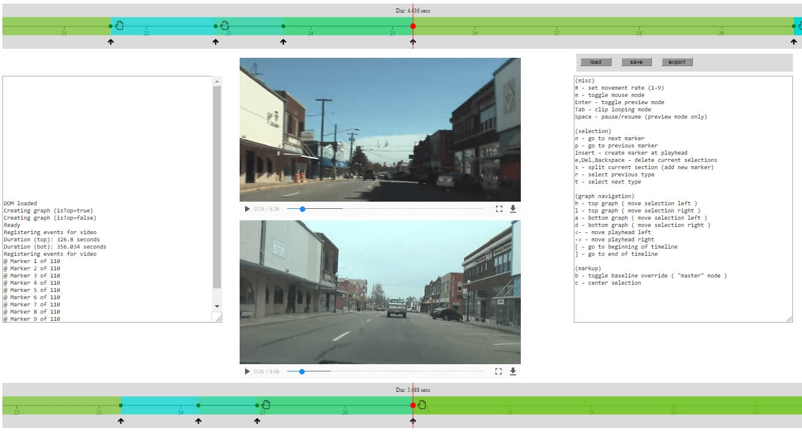
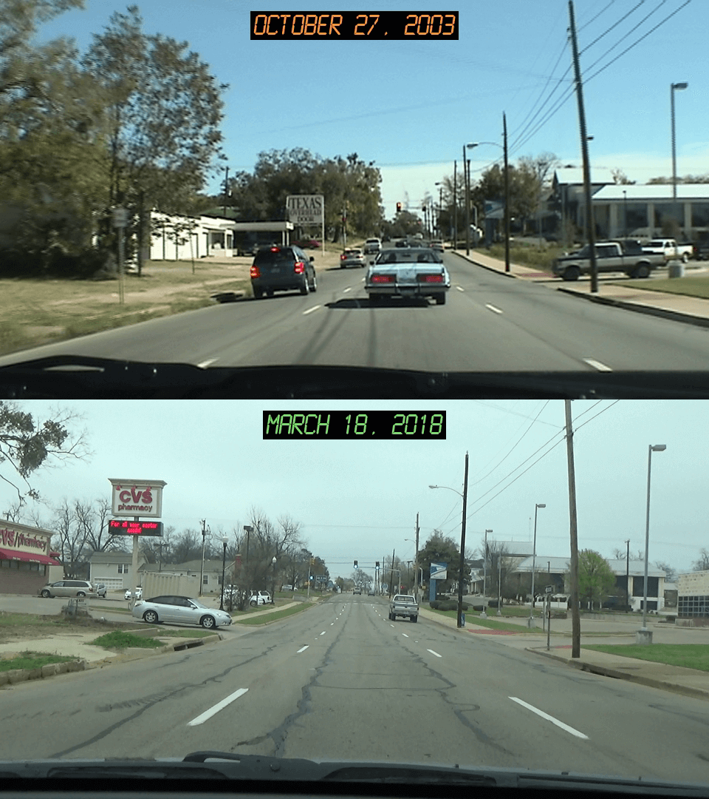

# Road Trip Replay - Multi-Video Synchronization with FFmpeg

[](https://www.youtube.com/watch?v=ojo1l0Wf2EI)

Over the last winter break I spent time archiving an old collection of camcorder tapes to hard drive. Most of the
recordings were just randomly-captured silly moments of yesteryear, but one particular set of videos caught my
attention: a few scenic joyrides across the familiar streets and neighborhoods of my hometown (Paris, Texas 🤠) in 2003.
	
<span class="more"></span>

Wondering exactly how much of the town had changed over the course of approximately 15 years, it occurred to me that I
could effectively answer that question just by re-recording the same journeys on my next Texas visit and comparing the
videos afterwards. Ultimately I wanted to create a split-screen video from this experiment, so accurate synchronization between the two videos was paramount.

And so I decided to embark on a new side project which ended up rewarding me with a much better understanding of [**FFmpeg**](https://www.ffmpeg.org/),
a wonderfully versatile video editing tool. This blog post basically documents that whole experiment.

I should briefly mention that while I work at Netflix, my official role there is as a *UI engineer* so I don't
consider myself an expert on *video*, even though it's a central component of our business.
If anything, I'm just doing fun things like this to learn more! 😀

## basic approach ( "slice, scale, and splice" )
The basic synchronization strategy I adopted was to initially split up each video into separate clip segments, demarcated by the timestamps of common geographic locations shared between the two clips ( i.e. all encountered street intersections. ) Afterwards, each *2003* segment was compared with its *2018* counterpart and ( generally speaking ) the shorter/fastest segment video was "slowed down" until its duration matched the longer/slower segment.


Once this process was complete, it was then just a matter of splicing the longest segments together to generate a final video.

*Note*: Originally I was able to accomplish this using Apple's *iMovie* ( thanks to its nifty
*[Speed](https://support.apple.com/kb/PH22933?locale=en_US&viewlocale=en_US)* slider feature ) however
over time I found it a bit tedious and error-prone ( the application supports only one primary video track and modifying
the segment durations by hand didn't alway feel precise )

## preparing the videos
Since I want my final split-screen video to be rendered in **1080p**, I chose to scale each clip to fit within a
**960x540** window. This size was intentionally chosen to preserve the original 16:9 aspect ratio of the two videos.

```bash
ffmpeg -i ./clip2003.avi -vcodec huffyuv -vf scale=960:540 -r 60 -vsync cfr -an clip2003_60fps_960x540.avi
ffmpeg -i ./clip2018.avi -vcodec huffyuv -vf scale=960:540 -r 60 -vsync cfr -an clip2018_60fps_960x540.avi
```

* **-i** *inputfile* <span style="color:blue"> -- Specifies the input file</span>
* **-vcodec** *codec* <span style="color:blue"> -- Chooses a video codec for the output video</span>
* **-vf scale=** *width:height* <span style="color:blue"> -- Changes the video resolution</span>
* **-r** *framerate* <span style="color:blue"> -- Sets new frame rate</span>
* **-vsync cfr** <span style="color:blue"> -- Forces output to be at a constant frame rate</span>
* **-an** <span style="color:blue"> -- Removes audio stream</span>

With the **-vcodec huffyuv** argument, I'm basically requesting that this operation output to a lossless AVI container. I'll be retaining
this parameter going forward with each subsequent ffmpeg call since I don't want to compromise the original video
quality. By the way, I could have configured this to output to a MP4 instead, since the H.264 codec also supports a
lossless mode. I decided to stick with the AVI format though since my earlier tests on a Win64 machine ran much faster.
There is one tradeoff to be aware of, the *HuffYUV* codec generates ridiculously large files. I wasn't too bothered by
this, since disk space is "cheap" as they say. 

I added the **-r 60 -vsync cfr** args to achieve a common constant frame rate between the two videos ( 60fps was the
higher FPS of the two original videos. ) This is important since it ensures better accuracy and
consistency on alignment later as the individual segments are synchronized ( The AVI format by default uses a variable rate, which isn't deterministic enough for our calculations.) 

I'm also using the **-an** parameter to strip out the audio since it's not really useful to me. Slowing down the video
segments would inconveniently affect the sound anyway and, besides, I can still add my own custom soundtrack later.

## creating the sync points

Next I'll define the official sync points of the two videos, i.e. those timestamps which represent common geographic
positions shared between the two separate video timelines. These sync points are used to divide up the clip into
multiple segments.  Generating these by hand was cumbersome, so I decided to quickly hack together a JavaScript-based
GUI ( affectionally named *Syncerator* ) to manage this for me. By writing a custom app I was able to quickly use keyboard
shortcuts to add, edit and delete the points. I also eventually extended it to include a live preview mode ( taking
advantage of HTML5 Video's adjustable *playbackRate* property. ) 

[](syncerator.jpg)

*Note:* You might notice above that the two embedded video frames don't exactly match up. This is because my camcorders
have different **[field of view](https://en.wikipedia.org/wiki/Field_of_view)** specs ( The newer lens has a
wider viewing angle and closer objects appear more stretched ) This didn't bother me that much during actual playback so
I just accepted it. 

## step 1: "slicing" ( splitting the clips into segments )

Once I have a list of curated timestamps, I can then iterate through them and extract the in-between segments:

// Example of first segment from each clip being extracted
```bash
ffmpeg -ss 0 -t 2 -i clip2003_60fps_960x540.avi -vcodec huffyuv -r 240 -vsync cfr segment_2003_1.avi
ffmpeg -ss 0 -t 3 -i clip2018_60fps_960x540.avi -vcodec huffyuv -r 240 -vsync cfr segment_2018_1.avi
```
* **-ss** *seconds* <span style="color:blue"> -- Seek to the starting timestamp position</span>
* **-t** *seconds* <span style="color:blue"> -- Limit duration to this amount</span>

In case you may be wondering why the **-i** argument is not listed first, this is just an optimization to prevent FFmpeg
from unnecessarily decoding the entire input video before seeking to the requested timestamp. It's basically informing
FFmpeg to apply the extraction directly on the input clip instead of the decoded output.

*Note:* The **-ss**, **-t** arguments also support the *hh:mm:ss* format. I just chose to use *seconds* in my case because it was simpler to directly export those units from the editor.

During the extraction you'll notice that I'm also artificially increasing the frame rate to a higher multiple
(**240fps**.) This is basically just a workaround to minimize precision loss later when the segments are scaled to a
calculated duration that might not perfectly align with the base frame rate. This may seem like a trivial concern at
first blush but as the multiple segments are concatenated it could have a cumulative effect causing the resulting videos to progressively fall more out of sync.

## step 2: "scaling" ( extending the shorter segments )

Now that all of the clip segments have been extracted, the next step is to evaluate them ( comparing the *2003* versions against *2018* )

For each pair, I identify the shorter segment and calculate the necessary scale factor which would be 
multiplied on the other segment in order to match the same duration.

**scaleFactor** = *durationOfLongerSegment* / *durationOfShorterSegment*

In the above example, since the *2003* sample segment ( 2 sec ) is shorter than the *2018* sample segment ( 3 sec ), a scale factor for the *2003* version will be determined:

**scaleFactor** = 3 seconds / 2 seconds = 1.5

To actually change the duration on the video itself, I'm basically going to be overriding the segment's **PTS** (*Presentation Time Stamp*.) The presentation timestamp represents the exact time in which a video frame should be rendered and also is generally used to synchronize other stream types such as audio and subtitles. 

FFmpeg exposes a **setpts** filter for customizing this. In this context, it helps to think of the current PTS as a variable. So
in order to change the resulting duration, I just need to multiply the scale factor as follows:

```bash
ffmpeg -i segment_2003_1.avi -vf "setpts=(1.5)*PTS" -vcodec huffyuv -vsync cfr segment_2003_1_scaled.avi
```
* **-vf** *filter* <span style="color:blue"> -- Set a custom video filter</span>

[](sync.gif)

*Note:* I'm favoring the longer segment duration in the comparisons above to keep this guide simple. It's a safe default to use if you want to maximize scenic footage but it's not always ideal. For example, it doesn't make much sense to slow a video segment to a crawl just because in the other segment a car is stuck waiting patiently 😑 at a red light. For that reason, I actually chose to override this behavior in a few cases.

## step 3: "splicing" ( reconnecting the segments )

At this point I've compared all of the segments so finally I'm going to use them to recreate the full videos - but include the newer (i.e. longer) versions this time.
To simplify this, I'm creating an ordered list of clips for each year:

```bash
    // segments2003.txt
    file 'segment_2003_1_scaled.avi'
    file 'segment_2003_2.avi'
    file 'segment_2003_3_scaled.avi'
    file 'segment_2003_4_scaled.avi'
    file 'segment_2003_5.avi'
    ...

    // segments2018.txt
    file 'segment_2018_1.avi'
    file 'segment_2018_2_scaled.avi'
    file 'segment_2018_3.avi'
    file 'segment_2018_4.avi'
    file 'segment_2018_5_scaled.avi'
    ...
```    

Now they can be joined together:

```bash
ffmpeg -f concat -i segments2003.txt -vcodec huffyuv -vsync cfr -r 60 final2003.avi
ffmpeg -f concat -i segments2018.txt -vcodec huffyuv -vsync cfr -r 60 final2018.avi
```
* **-f concat** - <span style="color:blue">Specifies input format as a list of files to join</span>

Once the segments are concatenated, I'm adding the **-r 60** argument to restore the original framerate ( since the
earlier *240fps* was only needed to help align the extracted and scaled segments )

## wrapping up 
### creating the split-screen

This final stage is mostly focused on presentation. To achieve a split-screen effect, I basically need to vertically stack the
final videos together. Once again, FFmpeg makes things easy for us:

```bash
ffmpeg -i final2003.avi -i final2018.avi -vcodec huffyuv -filter_complex vstack final_splitscreen.avi
```
* **-filter_complex** *filterType* <span style="color:blue"> --Select complex video filter</span>

( The **vstack** filter type above is informing FFmpeg to apply a "vertical stack" layout on the two input videos. )

Having a split-screen video is cool and all, but doesn't it doesn't provide much context to someone viewing it for the
first time. So I thought I'd have a little fun and add *Back To The Future*-esque LCD clock labels to each pane (
Special Thanks to Samuel Reynolds for creating the retro-LCD [font](https://www.dafont.com/lcd-lcd-mono.font) that was
used. )

The following command adds centered labels at the top of each pane of the 960x1080p video:

```bash
ffmpeg -i final_splitscreen.avi
    -vf "[in]drawtext=fontfile=./fonts/LCDMN___.ttf: text='MARCH 18, 2018': fontcolor=7DE06F: fontsize=34:
        box=1: boxcolor=black@1.0: boxborderw=5:
        x=(w-text_w)/2: y=540+20,
        drawtext=fontfile=./fonts/LCDMN___.ttf: text='OCTOBER 27, 2003': fontcolor=FF9A3D: fontsize=34:
	box=1: boxcolor=black@1.0: boxborderw=5:
        x=(w-text_w)/2: y=20"
   -vcodec huffyuv final_splitscreen_labeled.avi
```

[](bttf_small.png)

### publishing

I'm almost done at this point. I just need to do something about the really large video file which remains ( due to my earlier
decision of sticking with the lossless AVI format 😀)

That's not a problem since in this final step I'm going to transcode it to a much smaller Internet-friendly MP4 video
format by using the H.264 codec. Also, since I'm ultimately uploading this video to YouTube anyway, I'll include all of Google's recommending
settings ( Credit to Jernej Virag for nicely documenting the extra params [here](https://www.virag.si/2015/06/encoding-videos-for-youtube-with-ffmpeg/)):

```bash
ffmpeg -i final_splitscreen_labeled.avi -codec:v libx264
   -crf 21 -bf 2 -flags +cgop -pix_fmt yuv420p -codec:a aac
   -strict -2 -b:a 384k -r:a 48000 -movflags faststart final_splitscreen_labeled.mp4
```

Now is a good time to mention that the above command will actually produce a *lossy* video, although the [**Constant
Rate Factor**](https://trac.ffmpeg.org/wiki/Encode/H.264#crf) ( H.264's default quality setting )
can be directly configured by changing the **-crf** value. While the above CRF value of *21* introduces some quality
loss, it's a nice compromise since it's perceptibly lossless in most cases while having the benefit of better compression.

*Note*: The supported range of CRF is *0* to *51* ( with *0* being lossless and *51* representing worst quality / best
compression ) If the *-crf* argument isn't included in the command, FFmpeg will assume a default value of *23*.

## conclusion ##

Thanks for reading! If you feel inspired to go out and create your own multi-synced video, I'd love to hear about it (
please feel free to share it with a search-friendly **#roadtripsync** tag. ) To save you time with the synchronization
itself, [here](https://gist.github.com/joeycato/7f1d78e06e32f30e53ee4bbb4dbc7d50) is a Python script that automates the
"*slice, scale, and splice*" steps.
